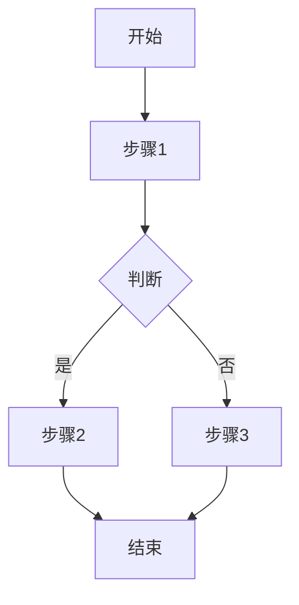
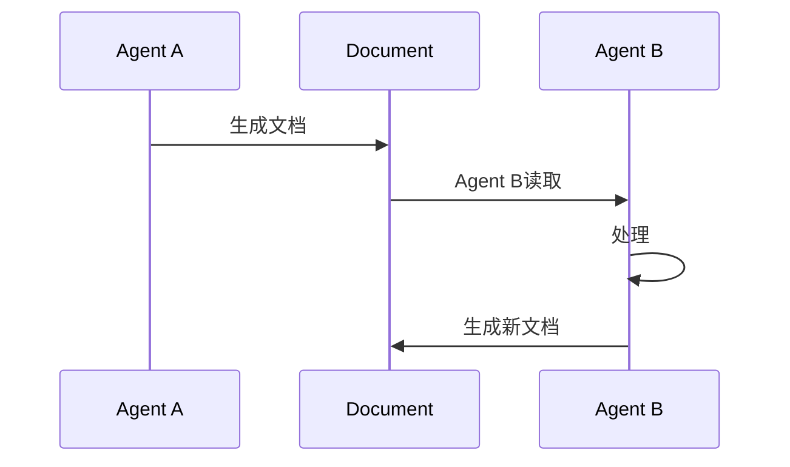
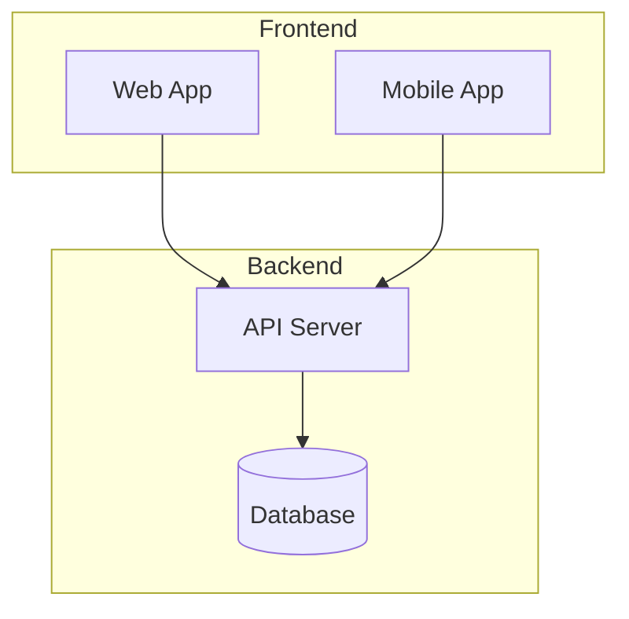

# Cursor ECC工作流系统 - 项目编码规范

本文档定义了Cursor ECC工作流系统的编码规范和最佳实践。

## 文档编写规范

### Markdown风格

#### 标题层级

```markdown
# H1 - 文档标题(每个文档只有一个)
## H2 - 主要章节
### H3 - 子章节
#### H4 - 详细点
```

**规则**:
- 不跳级(不要从H2直接到H4)
- H1用于文档标题,一个文档只有一个
- 最多使用到H4

#### 列表格式

**无序列表**:
```markdown
- 第一项
- 第二项
  - 嵌套项
  - 嵌套项
- 第三项
```

**有序列表**:
```markdown
1. 第一步
2. 第二步
3. 第三步
```

**任务列表**:
```markdown
- [ ] 未完成任务
- [x] 已完成任务
```

#### 代码块

**使用语言标记**:
````markdown
```typescript
interface User {
  id: string;
  name: string;
}
```
````

**支持的语言**:
- `typescript`, `javascript`, `jsx`, `tsx`
- `python`, `go`, `rust`, `java`
- `bash`, `shell`, `sh`
- `markdown`, `yaml`, `json`
- `sql`, `graphql`

#### 表格格式

```markdown
| 列1 | 列2 | 列3 |
|-----|-----|-----|
| 内容1 | 内容2 | 内容3 |
| 内容4 | 内容5 | 内容6 |
```

**对齐**:
- 左对齐: `|-----|`
- 居中: `|:---:|`
- 右对齐: `|-----:|`

### YAML Frontmatter规范

#### 必需字段

```yaml
---
title: 文档标题
status: draft | review | approved | implemented
created: YYYY-MM-DD
---
```

#### Agent定义Frontmatter

```yaml
---
name: agent-name
description: 简短描述(一句话)
tools: [Read, Write, Grep, Glob, Bash, AskQuestion]
model: opus | sonnet
---
```

**tools可用值**:
- `Read`: 读取文件
- `Write`: 写入文件
- `Grep`: 搜索代码
- `Glob`: 查找文件
- `Bash`: 执行命令
- `AskQuestion`: 询问用户
- `SemanticSearch`: 语义搜索

**model可用值**:
- `opus`: 最强推理能力,适合复杂决策(architect, planner)
- `sonnet`: 平衡性能,适合大多数任务

#### Skill定义Frontmatter

```yaml
---
name: skill-name
description: 简短描述
version: x.y.z
---
```

#### 文档引用

在Frontmatter中引用其他文档:

```yaml
---
requirement: docs/requirements/xxx.md
plan: docs/plans/xxx.md
architecture: docs/architecture/xxx.md
---
```

**规则**:
- 使用相对路径(从项目根开始)
- 路径不包含前导`/`
- 必须是实际存在的文件

### 内容结构规范

#### Agent文档结构

```markdown
---
name: agent-name
description: 描述
tools: [...]
model: opus
---

# 角色定义
[角色简介]

## 在工作流中的位置
[如果是流水线Agent,说明位置]

## 前置检查(必须)
[前置条件验证]

## 核心职责
[列出3-5个核心职责]

## 追问清单(如果需要追问)
[结构化的追问清单]

## 工作流程
### Step 1: [步骤名]
### Step 2: [步骤名]
...

## 输出格式
[输出文档的格式和位置]

## 红线原则
**禁止做:**
- ❌ [禁止事项1]
- ❌ [禁止事项2]

**必须做:**
- ✅ [必须事项1]
- ✅ [必须事项2]

## 交接说明
[完成后如何交接给下一个Agent]
```

#### Skill文档结构

```markdown
---
name: skill-name
description: 描述
version: x.y.z
---

# Skill名称

## 概述
[简短描述,1-2段]

## 何时使用
**适用场景:**
- 场景1
- 场景2

**不适用场景:**
- 场景1
- 场景2

## 工作流程
[详细流程说明]

## 使用示例
[实际使用示例]

## 相关资源
[链接到相关文档]
```

#### 命令文档结构

```markdown
# /command-name 命令

[一句话描述]

## 用法

```bash
/command-name [OPTIONS] [@references]
```

## 示例

```bash
/command-name --option=value @file.md
```

## 参数

| 参数 | 说明 | 默认值 |
|------|------|--------|
| --option | 选项说明 | default |

## 执行流程

[详细执行流程]

## 输出

[输出说明]

## 常见问题

### Q: 问题?
A: 答案
```

## 命名规范

### 文件命名

#### Agent文件

```
小写-连字符分隔.md
```

**示例**:
- `requirement-analyst.md`
- `spec-writer.md`
- `strict-coder.md`

#### Skill目录

```
小写-连字符分隔/
```

**示例**:
- `spec-driven-dev/`
- `continuous-learning/`
- `doc-sync/`

#### 命令文件

```
小写-连字符分隔.md
```

**示例**:
- `analyze.md`
- `learn-project.md`
- `instinct-status.md`

#### 工作流文档

**需求文档**:
```
YYYY-MM-DD-功能名.md
```

**其他文档**:
```
功能名.md  或  功能名-类型.md
```

**ADR文档**:
```
ADR-NNN-标题.md
```

### 目录命名

```
小写-连字符分隔/
```

**示例**:
- `requirements/`
- `architecture/`
- `specs/features/`

### ID命名

#### Instinct ID

```
domain-specific-pattern
```

**示例**:
- `prefer-functional-style`
- `always-test-first`
- `use-zod-validation`

#### 需求ID

```
REQ-NNN
```

**示例**:
- `REQ-001`
- `REQ-002`

#### 功能ID

```
F-NNN
```

**示例**:
- `F-001`
- `F-002`

## 代码示例规范

### TypeScript示例

```typescript
// ✅ 好的示例
interface User {
  id: string;          // UUID, 主键
  email: string;       // 邮箱, 唯一, 必填
  name: string;        // 姓名, 必填, 2-50字符
  status: UserStatus;  // 状态枚举
  createdAt: Date;     // 创建时间
  updatedAt: Date;     // 更新时间
}

enum UserStatus {
  ACTIVE = 'active',
  INACTIVE = 'inactive',
  BANNED = 'banned'
}

// ❌ 不好的示例
interface User {
  id: string;     // 用户ID
  email: string;  // 邮箱
}
```

**规则**:
- 每个字段都有注释说明类型约束
- 使用明确的类型而非any
- 枚举使用字符串值而非数字

### API示例

```typescript
// 请求
interface CreateUserRequest {
  email: string;   // required, email format
  name: string;    // required, 2-50 chars
  password: string; // required, min 8 chars
}

// 响应
interface CreateUserResponse {
  id: string;
  email: string;
  name: string;
  createdAt: string;
}

// 错误响应
interface ErrorResponse {
  code: string;      // 错误码, e.g., "VALIDATION_ERROR"
  message: string;   // 人类可读消息
  details?: object;  // 详细错误信息
}
```

### Bash示例

```bash
# ✅ 好的示例 - 带注释
# 复制工作流配置
cp -r ecc-workflow/.cursor/* .cursor/

# 创建文档目录
mkdir -p docs/{requirements,plans,architecture}

# ❌ 不好的示例 - 无注释
cp -r ecc-workflow/.cursor/* .cursor/
mkdir -p docs/{requirements,plans,architecture}
```

## 图表规范

### Mermaid图表

#### 流程图



#### 序列图



#### 架构图



### ASCII图表

用于简单的结构说明:

```
┌─────────────────────────────────────┐
│            系统架构                  │
├─────────────────────────────────────┤
│                                     │
│  Phase 1 ──▶ Phase 2 ──▶ Phase 3   │
│     │            │            │     │
│     ▼            ▼            ▼     │
│   需求文档      计划文档     架构文档 │
│                                     │
└─────────────────────────────────────┘
```

## 文本风格规范

### 强调

```markdown
**加粗** - 用于重要术语、强调
*斜体* - 用于引入新概念
`代码` - 用于代码片段、命令、文件名
```

### 状态标识

```markdown
✅ 成功/完成/已实现
❌ 失败/错误/禁止
⚠️ 警告/注意
🚧 门禁/检查点
⏳ 等待/进行中
📝 文档/记录
🎯 目标/重点
💡 提示/建议
```

### 引用

```markdown
> **注意**: 这是一个重要提示

> **警告**: 这个操作不可逆
```

## 链接规范

### 内部链接

**相对路径**(推荐):
```markdown
[需求文档](../requirements/xxx.md)
```

**Obsidian Wikilinks**(如果使用Obsidian):
```markdown
[[requirements/xxx|需求文档]]
```

### 外部链接

```markdown
[Cursor官网](https://cursor.sh/)
```

### 文档内锚点

```markdown
# 大标题 {#custom-id}

[跳转到大标题](#custom-id)
```

## 注释规范

### 文档注释

```markdown
<!-- 这是注释,不会在渲染时显示 -->

<!-- TODO: 待完成的内容 -->

<!-- FIXME: 需要修复的问题 -->
```

### 代码注释

```typescript
// 单行注释 - 用于简短说明

/**
 * 多行注释
 * 用于详细说明函数、接口等
 * 
 * @param id - 用户ID
 * @returns User对象
 */
function getUser(id: string): User {
  // ...
}
```

## 版本控制规范

### Commit Message格式

```
<type>(<scope>): <subject>

<body>

<footer>
```

**type类型**:
- `docs`: 文档变更
- `spec`: Spec变更
- `requirement`: 需求变更
- `architecture`: 架构变更
- `feat`: 新增功能(如果添加新Agent/Skill)
- `fix`: 修复问题
- `refactor`: 重构

**示例**:
```
docs(requirement): 添加用户登录需求文档

- 完成需求分析
- 明确功能范围
- 定义验收标准

Refs: #123
```

### 分支命名

```
<type>/<issue-number>-<description>
```

**示例**:
- `requirement/123-user-login`
- `spec/124-payment-api`
- `docs/125-update-readme`

## 最佳实践

### 1. 文档优先

在写任何代码之前先写文档:
- 需求文档 → 实施计划 → 架构方案 → Spec → 代码

### 2. 精准表达

避免模糊描述:
- ❌ "添加合适的校验"
- ✅ "添加email格式校验(RFC 5322标准)"

### 3. 可验证性

每个需求都有验收标准:
- ❌ "系统要快"
- ✅ "API响应时间 < 200ms (p95)"

### 4. 边界清晰

明确说明做什么和不做什么:
- 在范围内: [列表]
- 不在范围内: [列表]

### 5. 保持一致

- 使用统一的术语
- 遵循相同的文档结构
- 保持命名风格一致

### 6. 自文档化

文档应该自解释:
- 不需要额外的口头说明
- 新人可以独立理解
- 未来的自己可以快速回忆

## 相关资源

- [项目概览](../../docs/PROJECT_OVERVIEW.md)
- [技术架构](../../docs/technical/architecture.md)
- [API规范](../../docs/technical/api-conventions.md)
- [代码地图](../../docs/CODEMAPS/overview.md)

---

**规范版本**: v2.2  
**最后更新**: 2026-02-03  
**适用范围**: 所有Cursor ECC工作流系统文档
