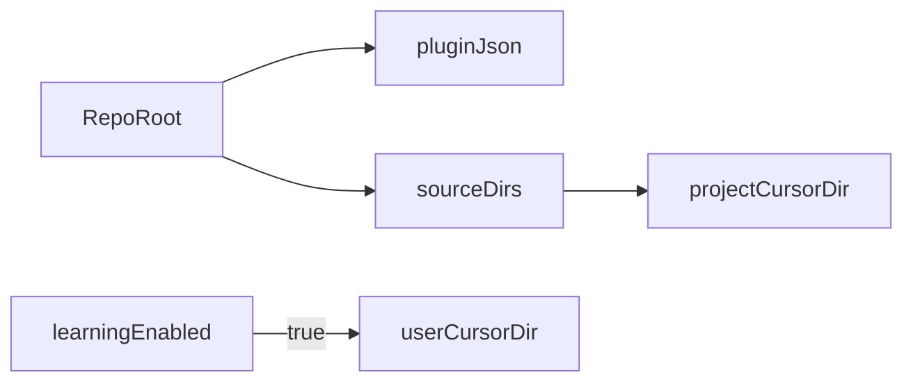

# ECC Workflow Plugin Contract

## 1. 目的与范围

本文档定义 `ecc-workflow` 的插件契约（single source of truth），用于约束以下内容：

- `plugin.json` 字段与组件入口
- 仓库目录与运行时目录的映射关系
- hooks 配置优先级与双兼容边界

本文档是后续重构 `scripts/install.sh` 与 `scripts/verify-setup.sh` 的唯一基线。

## 2. 规范来源

- Cursor Plugins: `https://cursor.com/docs/plugins`
- Cursor Third-party hooks: `https://cursor.com/docs/agent/third-party-hooks`
- Official schema: `https://raw.githubusercontent.com/cursor/plugins/main/schemas/plugin.schema.json`

## 3. Manifest 契约

插件 manifest 文件为 [`.cursor-plugin/plugin.json`](../../.cursor-plugin/plugin.json)。

### 3.1 必填与建议字段

- 必填：`name`
- 建议但应视为项目必填：`displayName`、`description`、`version`、`author`、`license`
- 组件字段：`skills`、`rules`、`agents`、`commands`、`hooks`

### 3.2 字段约束

- `name` 使用小写 kebab-case
- 组件字段统一使用相对路径，且必须指向仓库根目录下真实存在的目录
- `hooks` 当前采用路径模式（`"./hooks/"`），不在 manifest 中内联复杂 hooks 对象

## 4. 目录映射契约

### 4.1 仓库布局（源）

- `agents/`
- `skills/`
- `commands/`
- `rules/`
- `hooks/`
- `templates/`
- `.cursor-plugin/plugin.json`

### 4.2 目标布局（项目运行时）

- 项目级：`.cursor/agents`、`.cursor/skills`、`.cursor/commands`、`.cursor/rules`、`.cursor/hooks`、`.cursor/templates`
- 用户级（可选增强）：`~/.cursor/homunculus/*`

### 4.3 映射规则

- 仓库根目录组件 -> 项目 `.cursor/` 对应目录
- 仅在启用 learning 增强时处理 `~/.cursor/homunculus` 资产
- 不再依赖旧版源路径（`$WORKFLOW_DIR/.cursor/*`）

## 5. Hooks 契约

### 5.1 配置优先级

1. 项目级：`.cursor/hooks.json`（默认优先）
2. 用户级：`~/.cursor/hooks.json`（可覆盖项目默认行为）

### 5.2 命名与分层

- 主命名采用 Cursor 当前事件命名：`preToolUse`、`postToolUse`、`beforeSubmitPrompt`、`stop`
- 三层 hooks 模型：
  - `core`：通用质量与安全护栏
  - `learning`：观察与演化辅助
  - `compat`：旧行为兼容映射

### 5.3 阻断语义

- 仅对高风险动作使用阻断（例如直推主分支）
- 非关键检查失败应降级为提示，不中断主流程

## 6. 双兼容边界

### 6.1 官方核心模式（默认）

- 不依赖 homunculus
- 保障 `/analyze`、`/spec`、`/implement`、`/review`、`/sync` 主流程可执行

### 6.2 learning 增强模式（可选）

- 通过显式开关启用
- 写入/使用 `~/.cursor/homunculus` 与观察脚本
- 任何 learning 子模块失败不得破坏核心模式

## 7. 设计决策

- 以 manifest 与官方 schema 为准，不以历史安装脚本行为为准
- 安装器与验证器必须共享同一映射表与命名口径
- 所有迁移步骤必须支持 dry-run 与备份
