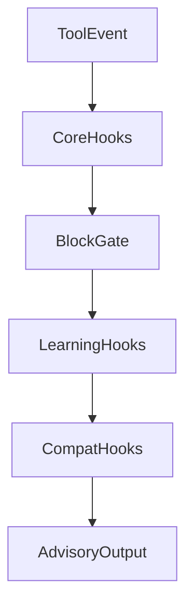

# Hooks Layering Spec

## 1. 目标

为 `ecc-workflow` 提供可维护的 hooks 体系，将现有行为按 `core/learning/compat` 分层，降低耦合并保障双兼容。

覆盖对象： [hooks/hooks.json](../../../hooks/hooks.json)

## 2. 分层定义

### 2.1 core 层

- 用途：通用质量与安全护栏
- 特征：轻量、稳定、与项目语言栈低耦合
- 示例：危险 Git 操作提示与阻断、基础写入提醒

### 2.2 learning 层

- 用途：持续学习与观察能力
- 特征：可选启用、失败自动降级
- 示例：会话观察记录、演化建议采集

### 2.3 compat 层

- 用途：承接历史行为，减少升级断裂
- 特征：有生命周期，默认可关闭，后续逐步淘汰
- 示例：旧变量名映射、旧事件名兼容提示

## 3. 配置模型

推荐逻辑模型（文档层）：

- `hooks.core.json`
- `hooks.learning.json`
- `hooks.compat.json`
- 目标输出：`.cursor/hooks.json`（由安装器按模式合成）

## 4. 执行优先级

- 核心阻断逻辑仅在 core 层
- learning 与 compat 只做提示或记录，默认不阻断主流程

## 5. 事件语义

统一使用 Cursor 当前事件名：

- `preToolUse`
- `postToolUse`
- `beforeSubmitPrompt`
- `stop`

兼容层可识别旧命名并转换，但不在新文档中继续推广旧命名。

## 6. 失败处理策略

- core:
  - 安全阻断命令：允许退出码触发阻断
  - 非关键检查：降级为 stderr 提示
- learning:
  - 任一钩子失败应自动 `|| true` 或等价降级
  - 不得影响工具主执行路径
- compat:
  - 仅提示迁移建议，不阻断

## 7. 安全与性能约束

- 禁止在 hooks 中引入长耗时或不确定网络依赖
- 对 shell 命令设置可预期执行时间
- 仅在高风险行为上使用阻断，避免误伤正常开发流

## 8. 与 install/verify 的接口

- install 负责按模式合成最终 `.cursor/hooks.json`
- verify 负责校验：
  - 事件命名合法
  - 分层目标是否匹配安装模式
  - 关键阻断规则是否存在（如主分支直推保护）

## 9. 迁移规则

- 旧 hooks 先进入 compat 层保留行为
- 新增能力优先进入 core/learning 层
- 每次版本升级记录 compat 减项计划
