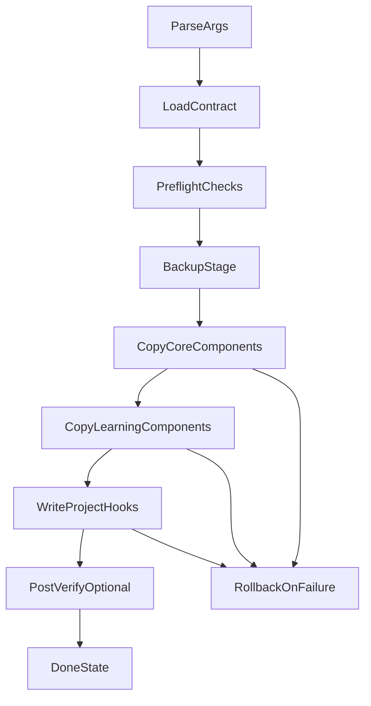

# 安装器重设计规格

## 1. 背景

当前安装脚本 [scripts/install.sh](../../../scripts/install.sh) 仍包含旧版 `.cursor/*` 源路径假设，与当前插件仓库根目录布局不一致。该规格定义新的安装语义，不直接修改脚本实现。

## 2. 目标

- 提供双模式安装：官方核心模式 + learning 增强模式
- 建立幂等安装行为：重复执行无副作用
- 提供可回滚机制：失败时可恢复关键配置

## 3. CLI 设计

### 3.1 参数

- `--marketplace`：官方核心模式（默认）
- `--enable-learning`：在核心模式基础上启用 learning 资产
- `--dry-run`：仅打印将执行动作，不落盘
- `--verify-after`：安装完成后调用验证流程
- `--target <path>`：目标项目路径（默认当前目录）

### 3.2 兼容参数

- 保留 `--verify` 入口，但重定向到验证器脚本
- 保留旧参数提示，输出迁移建议

## 4. 数据模型

安装器维护统一映射表（逻辑模型）：

- `agents/` -> `.cursor/agents/`
- `skills/` -> `.cursor/skills/`
- `commands/` -> `.cursor/commands/`
- `rules/` -> `.cursor/rules/`
- `hooks/` -> `.cursor/hooks/`
- `templates/` -> `.cursor/templates/`

learning 增强映射（仅 `--enable-learning`）：

- `skills/continuous-learning/hooks/observe.sh` -> `~/.cursor/hooks/observe.sh`
- learning 数据目录 -> `~/.cursor/homunculus/*`

## 5. 执行流程

## 6. Preflight 检查

- 目标目录存在且可写
- manifest 与核心目录存在性校验
- `--enable-learning` 时检查用户目录可写性
- 冲突检测：已有 `.cursor/hooks.json` 时按策略处理（保留、合并或备份覆盖）

## 7. 幂等策略

- 复制采用覆盖写入，但仅在内容变化时更新（可通过哈希或 diff 判定）
- 目录创建使用 `mkdir -p` 语义
- 用户级目录只创建缺失项，不清理已有学习数据
- 重复执行输出 `updated/unchanged/skipped` 三类统计

## 8. 回滚策略

### 8.1 回滚触发

- 核心组件复制失败
- hooks 写入失败
- learning 增强阶段关键文件复制失败（仅增强模式）

### 8.2 回滚粒度

- 项目级回滚：恢复 `.cursor/` 被覆盖文件的备份
- 用户级回滚：仅回滚本次新增/覆盖文件，不删除历史学习数据目录

### 8.3 备份规则

- 备份路径：`.cursor/.ecc-backup/<timestamp>/`
- 仅备份将被修改的文件
- 提供 `restore` 指令提示

## 9. 输出契约

安装器输出固定结构：

- 模式：`marketplace` / `marketplace+learning`
- 变更摘要：created/updated/unchanged/skipped/failed
- 关键文件列表
- 下一步建议：`verify`、推荐命令、迁移提示

## 10. 非目标

- 本规格不定义具体 shell 实现细节
- 本规格不引入自动联网安装或远端依赖下载
