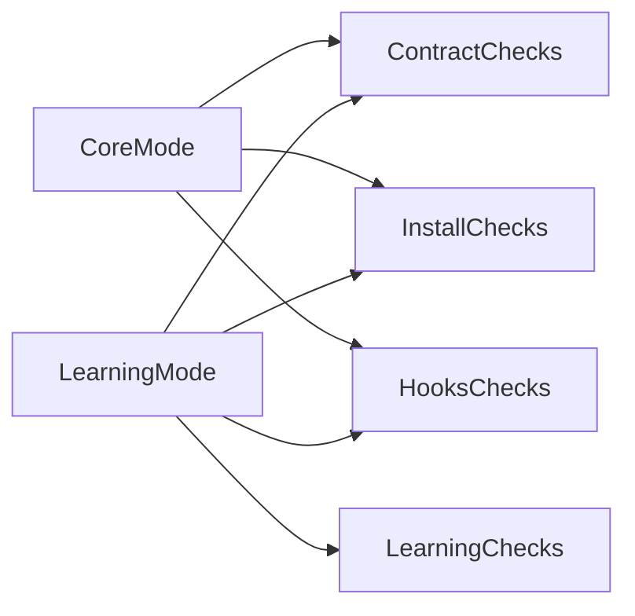

# Verify Redesign Spec

## 1. 背景

现有验证脚本 [scripts/verify-setup.sh](../../../scripts/verify-setup.sh) 与安装脚本口径不一致，且包含历史路径假设。该规格定义新的验证语义与输出格式。

## 2. 目标

- 基于插件契约进行一致性验证
- 支持模式化验收（核心模式 / 增强模式）
- 输出分级结果（ERROR/WARN/INFO），便于 CI 与本地诊断

## 3. 输入参数

- `--mode core`：仅验证官方核心模式
- `--mode learning`：验证核心 + learning 增强
- `--json`：输出机器可读结果
- `--strict`：将 WARN 提升为失败

默认模式：`core`。

## 4. 校验分组

### 4.1 Contract 组

- `.cursor-plugin/plugin.json` 存在且满足 schema 基本约束
- manifest 声明的组件目录真实存在

### 4.2 Install 组

- 项目 `.cursor/` 目录是否按映射存在
- hooks 目标文件是否存在（`.cursor/hooks.json`）

### 4.3 Hooks 组

- hooks 顶层结构合法（`version`、`hooks`）
- 事件命名采用当前规范
- 核心阻断规则存在且可识别

### 4.4 Learning 组（仅 learning 模式）

- `~/.cursor/homunculus` 关键目录存在
- 观察脚本存在且可执行
- 缺失 learning 资产时应提示安装开关，不直接报核心失败

## 5. 分级标准

- `ERROR`：契约破坏或核心能力不可用，返回非 0
- `WARN`：建议修复项或兼容层异常，默认不阻断
- `INFO`：状态信息和迁移建议

## 6. 输出格式

人类可读输出：

- Summary：passed/failed/warned
- Group result：Contract/Install/Hooks/Learning
- Actions：下一步命令建议

JSON 输出字段建议：

- `mode`
- `status` (`pass`/`fail`)
- `errors[]`
- `warnings[]`
- `infos[]`
- `checks[]`（含分组、名称、结果、详情）

## 7. 验收矩阵

## 8. 与安装器联动

- verify 读取与 install 相同的映射定义
- verify 输出中必须标注当前安装模式推断结果
- 若检测到旧布局（如源路径依赖），输出迁移建议并归类 `WARN`

## 9. 非目标

- 不负责自动修复配置
- 不负责触发安装流程
