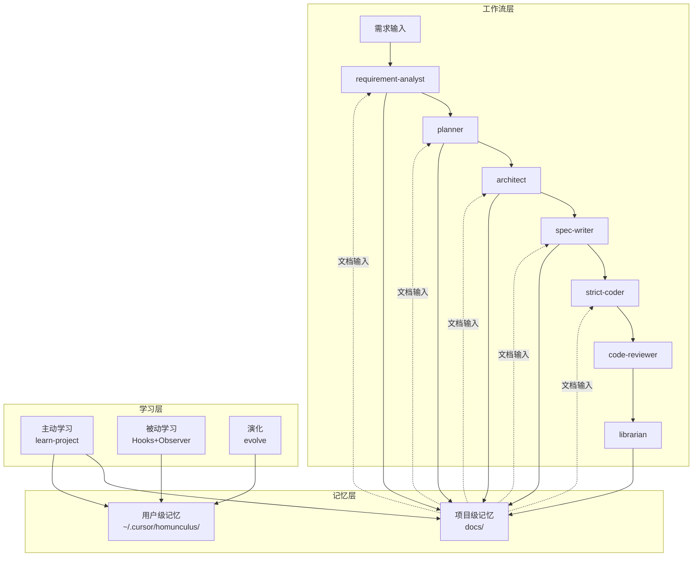
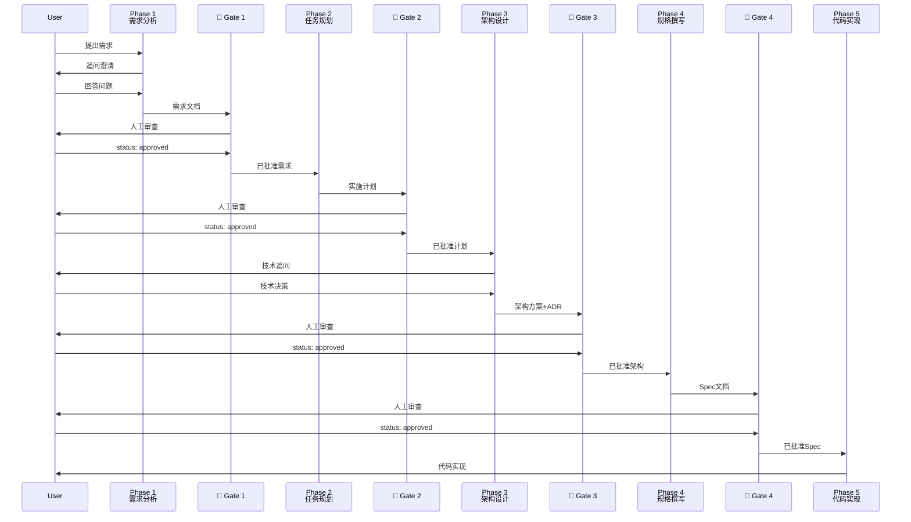
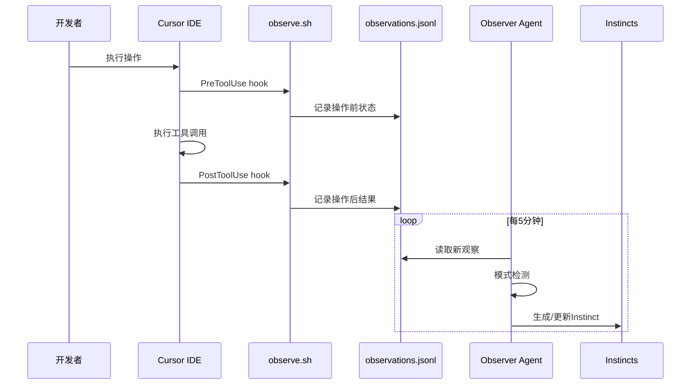

# Cursor ECC工作流系统 - 技术架构

## 架构概述

Cursor ECC工作流系统采用**文档驱动的流水线架构**,通过多个专业化Agent协同工作,将AI辅助开发从自由式对话转变为结构化工程流程。

## 核心架构原则

1. **文档先于代码** - 所有实现都基于明确的文档规格
2. **门禁控制质量** - 每个阶段都有人工审查点
3. **Agent专业化** - 每个Agent只做一件事并做到极致
4. **双层记忆** - 项目记忆(Git)和用户记忆(本地)分离
5. **可演化学习** - 系统从使用中学习并自我优化

## 系统架构图

### 整体架构



### 5阶段门禁流程



## 核心模块设计

### Agent架构

每个Agent都是独立的Markdown文件,包含:

```yaml
---
name: agent-name
description: 角色描述
tools: [Read, Write, Grep, Glob, Bash, AskQuestion]
model: opus | sonnet
---

# Agent内容结构
- 角色定义
- 核心原则
- 工作流程
- 输出格式
- 红线原则
- 交接说明
```

#### Agent通信协议

Agent之间通过**文档**通信,不直接交互:

```
Agent A ──▶ 生成文档 ──▶ 文件系统 ──▶ Agent B读取 ──▶ Agent B
```

**优点:**
- 解耦: Agent可独立开发和测试
- 可追溯: 所有中间状态都有文档记录
- 可回滚: 可以回到任何历史状态
- 可审查: 人类可以介入任何环节

### 双层记忆架构

```
┌─────────────────────────────────────────────────────┐
│                  记忆架构设计                         │
├─────────────────────────────────────────────────────┤
│                                                     │
│  项目级记忆 (docs/)                                  │
│  ┌───────────────────────────────────────────────┐ │
│  │  - 存储位置: 项目目录                           │ │
│  │  - 版本控制: Git跟踪                            │ │
│  │  - 共享方式: Git自动同步                        │ │
│  │  - 内容类型: Spec、计划、ADR、Codemap           │ │
│  │  - 更新方式: 手动 + Librarian Agent             │ │
│  └───────────────────────────────────────────────┘ │
│                                                     │
│  用户级记忆 (~/.cursor/homunculus/)                  │
│  ┌───────────────────────────────────────────────┐ │
│  │  - 存储位置: 用户Home目录                       │ │
│  │  - 版本控制: 不跟Git                            │ │
│  │  - 共享方式: export/import手动                  │ │
│  │  - 内容类型: Instinct、编码习惯、演化产物       │ │
│  │  - 更新方式: 自动(Hooks + Observer)             │ │
│  └───────────────────────────────────────────────┘ │
│                                                     │
└─────────────────────────────────────────────────────┘
```

**设计理由:**
- **项目级**: 功能设计是团队共享的,应该版本化
- **用户级**: 个人编码习惯是私有的,不应污染项目仓库

### 学习系统架构

#### 主动学习 (`/learn-project`)

```mermaid
flowchart TD
    Start[/learn-project] --> Scan[项目扫描]
    Scan --> Detect{检测项目类型}
    
    Detect -->|前端| FE[前端分析]
    Detect -->|后端| BE[后端分析]
    Detect -->|全栈| FS[全栈分析]
    Detect -->|配置系统| CF[配置分析]
    
    FE --> Extract[知识提取]
    BE --> Extract
    FS --> Extract
    CF --> Extract
    
    Extract --> Docs[生成文档]
    Extract --> Rules[生成规范]
    Extract --> Inst[生成Instincts]
    
    Docs --> Out1[PROJECT_OVERVIEW.md]
    Docs --> Out2[ONBOARDING.md]
    Docs --> Out3[CODEMAPS/]
    
    Rules --> Out4[project-standards.md]
    
    Inst --> Out5[~/.cursor/homunculus/instincts/]
    
    Out1 --> Report[生成报告]
    Out2 --> Report
    Out3 --> Report
    Out4 --> Report
    Out5 --> Report
```

#### 被动学习 (Hooks + Observer)



## 技术栈

### 核心技术

| 组件 | 技术 | 说明 |
|------|------|------|
| 文档格式 | Markdown | 通用、可读、版本化 |
| AI模型 | Claude Opus/Sonnet | 高质量推理和代码生成 |
| IDE | Cursor | AI增强编辑器 |
| 笔记工具 | Obsidian(可选) | 可视化文档管理 |
| 版本控制 | Git | 项目级记忆版本化 |
| 脚本语言 | Shell | Hooks实现 |

### 数据格式

#### 需求文档 (Phase 1)

```markdown
---
title: 功能名称
status: clarified | approved
created: YYYY-MM-DD
analyst: requirement-analyst
---

# 内容
- 概述
- 用户场景
- 功能需求(P0/P1/P2)
- 非功能需求
- 范围边界
- 约束与依赖
- 风险与缓解
- 验收清单
- 决策记录
```

#### 实施计划 (Phase 2)

```markdown
---
title: 功能名称 实施计划
status: draft | approved
created: YYYY-MM-DD
requirement: docs/requirements/xxx.md
---

# 内容
- 概述
- 需求背景
- 技术方案
- 任务分解(Phase/Task结构)
- 测试策略
- 风险与缓解
- 验收检查清单
```

#### 架构方案 (Phase 3)

```markdown
---
title: 功能名称 架构方案
status: draft | approved
created: YYYY-MM-DD
requirement: docs/requirements/xxx.md
plan: docs/plans/xxx.md
---

# 内容
- 概述
- 需求回顾
- 架构方案(多方案对比)
- 详细设计(数据模型、API、模块)
- 技术决策(链接到ADR)
- 风险与缓解
- 下一步
```

#### Spec文档 (Phase 4)

```markdown
---
title: 功能名称
status: draft | approved | implemented
created: YYYY-MM-DD
architecture: docs/architecture/xxx.md
---

# 内容
- 概述
- 功能需求
- 数据模型(TypeScript interface)
- API设计(请求/响应/错误码)
- UI/组件设计
- 边界情况
- 安全考虑
- 测试策略
- 验收检查清单
```

#### Instinct (Continuous Learning)

```markdown
---
id: instinct-id
trigger: "触发条件"
confidence: 0.3-0.9
domain: "领域标签"
source: "来源"
created: YYYY-MM-DD
---

# Instinct标题

## 行为
[描述应该做什么]

## 证据
[支持这个Instinct的证据]

## 示例
[代码示例]
```

## 设计模式

### 门禁模式 (Gate Pattern)

**目的**: 防止在模糊需求上浪费时间

**实现**:
```markdown
---
status: draft | clarified | approved | rejected
---
```

**规则**:
- 只有`status: approved`的文档可以作为下游输入
- 每个Gate都需要人工审查
- 审查通过后改为`approved`
- 发现问题改为`rejected`并说明原因

### 追问模式 (Clarification Pattern)

**目的**: 消除需求和技术上的模糊性

**实现**:
- requirement-analyst有5大类追问清单
- architect有4大类技术追问清单
- 每个追问都有状态跟踪(⬜ 未确认 / ✅ 已确认)

### Spec即法律模式 (Spec as Law)

**目的**: 确保实现与设计完全一致

**实现**:
- strict-coder只实现Spec中定义的内容
- 禁止自由发挥、禁止添加未定义功能
- 遇到Spec缺失立即询问而非猜测

### 演化模式 (Evolution Pattern)

**目的**: 从原子化Instinct演化为可复用资源

**流程**:
```
Instinct (原子) ──▶ 聚类 ──▶ Skill/Command/Agent (复合)
```

**聚类条件**:
- 相同domain的Instinct数量 >= 3
- 置信度 >= 0.7
- 有明确的主题

## 扩展性设计

### 添加新Agent

1. 创建`.cursor/agents/new-agent.md`
2. 定义YAML frontmatter(name, description, tools, model)
3. 编写角色职责和工作流程
4. 在`.cursor/rules/agent-routing.md`添加路由规则

### 添加新Skill

1. 创建`.cursor/skills/new-skill/`
2. 编写`SKILL.md`主文档
3. 可选创建子目录(`commands/`, `agents/`)
4. 在主README注册

### 添加新命令

1. 创建`.cursor/commands/new-command.md`
2. 定义用法、参数、示例
3. 关联对应的Agent或Skill

### 集成外部工具

通过Hooks集成:

```json
{
  "hooks": {
    "PreToolUse": [{
      "matcher": "*",
      "hooks": [{
        "type": "command",
        "command": "path/to/external-tool.sh pre"
      }]
    }]
  }
}
```

## 性能考虑

### 主动学习性能

| 深度 | 时长 | 分析范围 |
|------|------|---------|
| Quick | 5-10分钟 | README + 配置 + 目录结构 |
| Medium | 20-30分钟 | + 核心模块 + API + 测试 |
| Deep | 1小时+ | + 全量代码 + 业务逻辑 |

**优化策略**:
- 使用SemanticSearch而非全量读取
- 并行分析多个模块
- 缓存已分析结果

### 被动学习性能

- Observer Agent使用轻量模型(Haiku)降低成本
- 每5分钟批量处理观察数据而非实时
- observations.jsonl定期归档避免文件过大

## 安全考虑

### 隐私保护

- **项目级记忆**: 公开,存储在Git
- **用户级记忆**: 私有,仅存储在本地
- **观察数据**: 仅存储工具调用元数据,不存储实际代码内容
- **Instinct**: 只记录模式,不记录具体代码

### 导出/导入安全

- Instinct导出只包含模式和示例
- 不包含敏感信息(API密钥、密码等)
- 导入前可预览内容

## 相关文档

- [项目概览](../PROJECT_OVERVIEW.md)
- [新人上手指南](../ONBOARDING.md)
- [代码地图](../CODEMAPS/overview.md)
- [API规范](./api-conventions.md)
- [记忆架构说明](../memory-architecture.md)

---

**架构版本**: v2.2  
**最后更新**: 2026-02-03  
**维护者**: ECC Workflow Team
