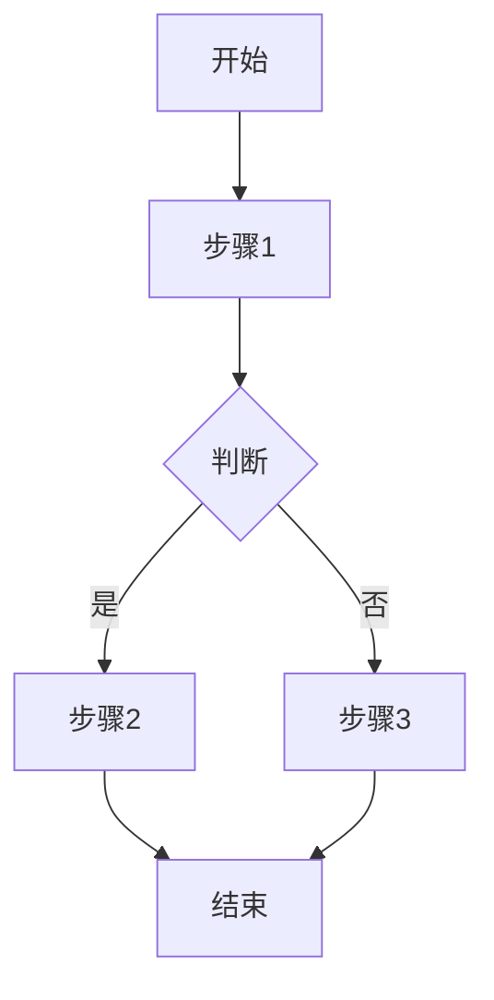

# [功能名称] 技术规格

## 1. 概述

### 1.1 背景
[为什么需要这个功能？解决什么问题？]

### 1.2 用户故事
作为 [角色]，我希望 [功能]，以便 [价值]。

### 1.3 范围

**包含:**
- [明确包含的内容]

**不包含:**
- [明确排除的内容]

---

## 2. 功能需求

### 2.1 核心流程



### 2.2 详细需求

#### REQ-001: [需求名称]
- **描述**: [详细描述]
- **触发条件**: [何时触发]
- **预期结果**: [期望行为]
- **验收标准**: [如何验证]

#### REQ-002: [需求名称]
- **描述**: [详细描述]
- **触发条件**: [何时触发]
- **预期结果**: [期望行为]
- **验收标准**: [如何验证]

---

## 3. 数据模型

### 3.1 实体定义

```typescript
interface Entity {
  id: string;          // 主键，UUID v4
  field1: string;      // 描述，约束
  field2: number;      // 描述，约束
  status: Status;      // 状态枚举
  createdAt: Date;     // 创建时间
  updatedAt: Date;     // 更新时间
}

enum Status {
  ACTIVE = 'active',
  INACTIVE = 'inactive'
}
```

### 3.2 字段约束

| 字段 | 类型 | 必填 | 约束 | 默认值 |
|------|------|------|------|--------|
| id | string | ✅ | UUID v4 | auto |
| field1 | string | ✅ | 2-50 chars | - |
| field2 | number | ❌ | >= 0 | 0 |

---

## 4. API 设计

### 4.1 端点列表

| 方法 | 端点 | 描述 | 权限 |
|------|------|------|------|
| POST | /api/resources | 创建资源 | authenticated |
| GET | /api/resources/:id | 获取资源 | authenticated |
| PUT | /api/resources/:id | 更新资源 | owner |
| DELETE | /api/resources/:id | 删除资源 | admin |

### 4.2 详细定义

#### POST /api/resources

**请求:**
```typescript
interface CreateRequest {
  field1: string;   // required, 2-50 chars
  field2?: number;  // optional, >= 0
}
```

**响应:**
```typescript
// 201 Created
interface CreateResponse {
  id: string;
  field1: string;
  field2: number;
  createdAt: string;
}

// 400 Bad Request
interface ErrorResponse {
  code: string;
  message: string;
  details?: object;
}
```

**错误码:**

| 状态码 | 错误码 | 描述 |
|--------|--------|------|
| 400 | VALIDATION_ERROR | 参数校验失败 |
| 401 | UNAUTHORIZED | 未认证 |
| 403 | FORBIDDEN | 无权限 |
| 404 | NOT_FOUND | 资源不存在 |

---

## 5. UI/组件设计

### 5.1 组件结构

```
PageComponent
├── HeaderComponent
├── FormComponent
│   ├── Input1
│   ├── Input2
│   └── SubmitButton
└── FooterComponent
```

### 5.2 组件 Props

```typescript
interface FormComponentProps {
  initialData?: FormData;
  onSubmit: (data: FormData) => Promise<void>;
  loading?: boolean;
  error?: string;
}
```

### 5.3 状态定义

```typescript
interface PageState {
  data: FormData;
  isLoading: boolean;
  error: string | null;
}
```

---

## 6. 边界情况

### 6.1 异常处理

| 场景 | 处理方式 | 用户反馈 |
|------|----------|----------|
| 网络超时 | 重试 3 次 | "网络不稳定，请重试" |
| 数据无效 | 返回 400 | 显示具体错误字段 |
| 服务器错误 | 记录日志 | "服务暂时不可用" |

### 6.2 并发处理

[描述并发场景及处理策略]

### 6.3 性能要求

| 指标 | 目标值 |
|------|--------|
| API 响应时间 | < 200ms (p95) |
| 页面加载时间 | < 2s |

---

## 7. 安全考虑

- [ ] 输入校验（防 XSS、SQL 注入）
- [ ] 权限验证
- [ ] 敏感数据加密
- [ ] Rate Limiting
- [ ] 审计日志

---

## 8. 测试策略

### 8.1 单元测试
- [ ] `validateInput()` 函数
- [ ] `transformData()` 函数

### 8.2 集成测试
- [ ] POST /api/resources 创建流程
- [ ] 权限校验流程

### 8.3 E2E 测试
- [ ] 完整用户操作流程

---

## 9. 验收检查清单

- [ ] REQ-001 实现并测试
- [ ] REQ-002 实现并测试
- [ ] API 符合定义
- [ ] 测试覆盖率 > 80%
- [ ] 安全检查通过
- [ ] 文档已更新

---

## 变更历史

| 版本 | 日期 | 变更内容 | 作者 |
|------|------|----------|------|
| 1.0 | YYYY-MM-DD | 初始版本 | @author |
